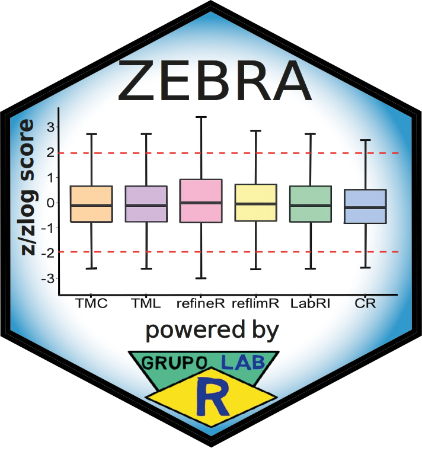

# [Z-score Evaluation, Benchmarking, and Ranking Algorithm (ZEBRA)](https://img.shields.io/badge/LabRI%20Shiny%20Application-%230070C0?style=for-the-badge&logoColor=white)

  <button type="button" class="btn-close" data-bs-dismiss="alert"></button>
  The <strong>Z-score Evaluation, Benchmarking, and Ranking Algorithm (ZEBRA)</strong> is a custom tool for comparing the performance of indirect reference interval (RI) estimation methods. The tool converts laboratory test results into standardized <strong>z</strong> or <strong>zlog</strong> scores according to the distributional shape (approximately Gaussian vs. skewed), thereby mapping original measurements onto a common standardized scale determined by the RI limits. ZEBRA generates method-specific comparative <strong>box plots</strong> for visual inspection of standardized-score distributions across evaluated methods, using both <strong>real and simulated datasets</strong> and, when applicable, <strong>subsampling scenarios</strong>. Agreement between each indirect method and the comparative reference is quantified using <strong>Lin’s concordance correlation coefficient (&rho;c)</strong> with a <strong>99.5% confidence interval</strong>, computed from paired comparisons between standardized scores derived from the comparative reference limits and those produced by each method. For ranking, the <strong>lower bound</strong> of the ρc confidence interval is categorized and mapped to a <strong>six-point Likert scale</strong>; scores are aggregated to generate an overall ranking of the evaluated indirect methods. Finally, the individual plots are assembled into a <strong>multi-panel composite figure</strong> for integrated reporting.

 

**Outputs from ZEBRA1.Rmd and ZEBRA2.Rmd include:**

**(i)** high-resolution method-specific figures (box plots); 

**(ii)** a multi-panel composite figure (assembly) integrating all individual plots; 

**(iii)** .csv files containing standardized z/zlog scores for each laboratory test (Group 1) and for each sample-size scenario (Group 2); and 

**(iv)** a complete HTML report with all analyses, tables, interpretations, and visualizations generated by ZEBRA.

---

## [𝗖𝗼𝗻𝘁𝗮𝗰𝘁](https://img.shields.io/badge/LabRI%20Shiny%20Application-%230070C0?style=for-the-badge&logoColor=white)

You are welcome to:

**Submit suggestions and Bugs at:** https://github.com/labrgrupo/LabRI_Tool/issues

**Write an Email with any questions and problems to:** alancdias@hotmail.com or labrgrupo@gmail.com

**Link to the publication:** 

---
